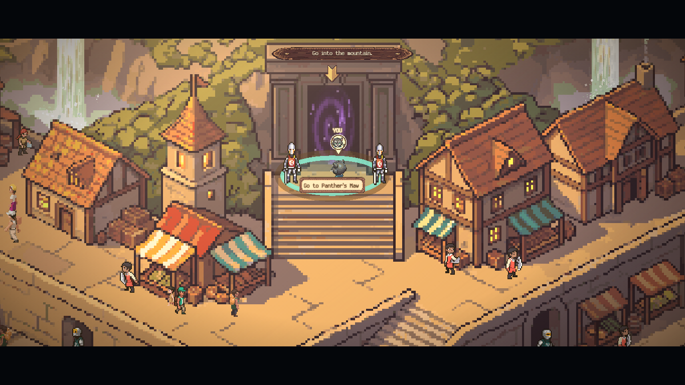

# BLHS Island Explorer, the islands

The islands of the BLHS Island Explorer game, one folder each, written in Python by Algorithmic Thinking Club members. You own a folder. Nobody else edits it, and you never touch the engine. What you write runs inside the real game next to everyone else's islands.

Play the game: https://blhs-island-explorer.vercel.app



## What an island is

Three files in a folder under `islands/`:

- `island.json` says which map it runs on and what it is
- `island.py` says what happens: who meets the player, the tasks, what each spot does when pressed
- `lines.py` is every sentence anyone says

The game does the sailing, the arrival, the task list and the trophy wall for you. Copy `islands/skeleton` to start; it is a complete island in under a hundred lines.

## The two rules

A word only happens if you yield it:

```python
yield say("You made it.")   # shows in the box and waits for the click
say("You made it.")         # nothing happens
```

Nothing calls your functions. The game does:

```python
@on_talk("greeter")
def meet_the_greeter():
    yield say("You're new here.", who="greeter")
```

The player walks to the spot named `greeter`, presses E, and the game calls that function. `@on_start` runs once when the island loads. Every word you can say is in [docs/VOCABULARY.md](docs/VOCABULARY.md).

## Build one

1. Clone this repository and the engine ([BLHS-Vine](https://github.com/Algorithmic-Thinking-Club/BLHS-Vine)) side by side, and run the engine with `npm run dev`.
2. Paint your map in [MAPVIS](https://github.com/ashwath-polali/MAPVIS) and name the spots on it. Your Python refers to those names.
3. Copy `islands/skeleton` to `islands/<your-island>` and write it.
4. Run `python -m unittest -v` here, and add your island's line to `src/game/roster/member-islands.json` in the engine and open it at `http://localhost:5173/?scene=pmap&map=<your map id>`.
5. Open a pull request. The tests run on it automatically.

## Help

The `atc` island is a full one you can read. Ask in the club, room 303 after school.
