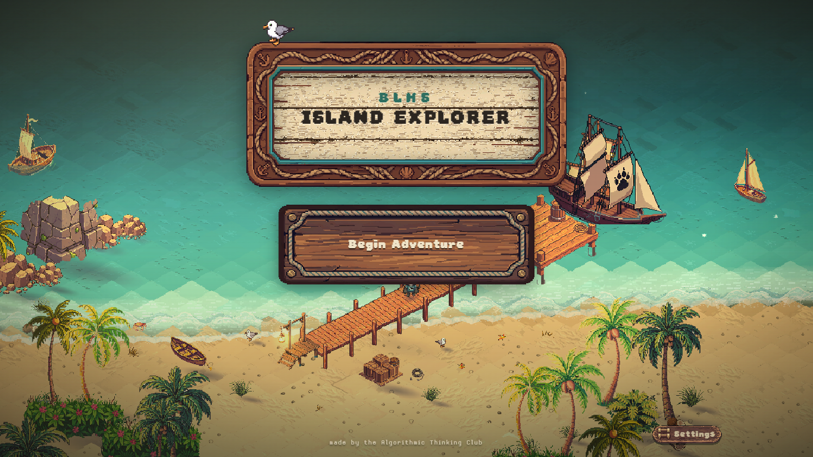

# BLHS Island Explorer

A game that shows Bonney Lake High School freshmen what the school has to offer: the clubs, the sports, the electives, the cords you can earn. You play as Thor, the school's panther, sail between islands, and every island is one real thing at the school. It runs in a browser on a school Chromebook with nothing to install.

Play it: https://blhs-island-explorer.vercel.app



## This repository

This is where the islands live, one folder each, written in Python by Algorithmic Thinking Club members. You own a folder, nobody else edits it, and you never touch the engine. What you write runs inside the real game next to everyone else's islands.

| Repository | What it is |
| --- | --- |
| [BLHS-Island-Explorer](https://github.com/Algorithmic-Thinking-Club/BLHS-Island-Explorer) | the islands, this one |
| [BLHS-Vine](https://github.com/Algorithmic-Thinking-Club/BLHS-Vine) | the engine that runs them |
| [MAPVIS](https://github.com/ashwath-polali/MAPVIS) | the map tool the islands are painted in |

## What an island is

Three files in a folder under `islands/`:

- `island.json` says which map it runs on and what it is
- `island.py` says what happens: who meets the player, the tasks, what each spot does when pressed
- `lines.py` is every sentence anyone says

The game does the sailing, the arrival, the task list and the trophy wall for you. `islands/skeleton` is a complete island in under a hundred lines; copy it to start. `islands/atc` is a full one you can read.

## The two rules

A word only happens if you yield it:

```python
yield say("You made it.")   # shows in the box and waits for the click
say("You made it.")         # nothing happens
```

Nothing calls your functions. The game does:

```python
@on_talk("greeter")
def meet_the_greeter():
    yield say("You're new here.", who="greeter")
```

The player walks to the spot named `greeter`, presses E, and the game calls that function. `@on_start` runs once when the island loads. Every word you can say is in [docs/VOCABULARY.md](docs/VOCABULARY.md).

## Build one

1. Clone this repository and the engine side by side, and run the engine with `npm run dev`.
2. Paint your map in MAPVIS and name the spots on it. Your Python refers to those names.
3. Copy `islands/skeleton` to `islands/<your-island>` and write it.
4. Run `python -m unittest -v` here. Add your island's line to `src/game/roster/member-islands.json` in the engine and open it at `http://localhost:5173/?scene=pmap&map=<your map id>`.
5. Open a pull request. The tests run on it.

## Where things are

- `islands/` every island, one folder each
- `islands/skeleton/` the one to copy
- `docs/VOCABULARY.md` every word, generated from the engine so it cannot drift
- `tests/` what runs on every pull request
- `vine.py` and `grape.py` the runtime, kept identical to the engine's copy

Built by the Algorithmic Thinking Club at Bonney Lake High School. We meet in room 303 after school.
